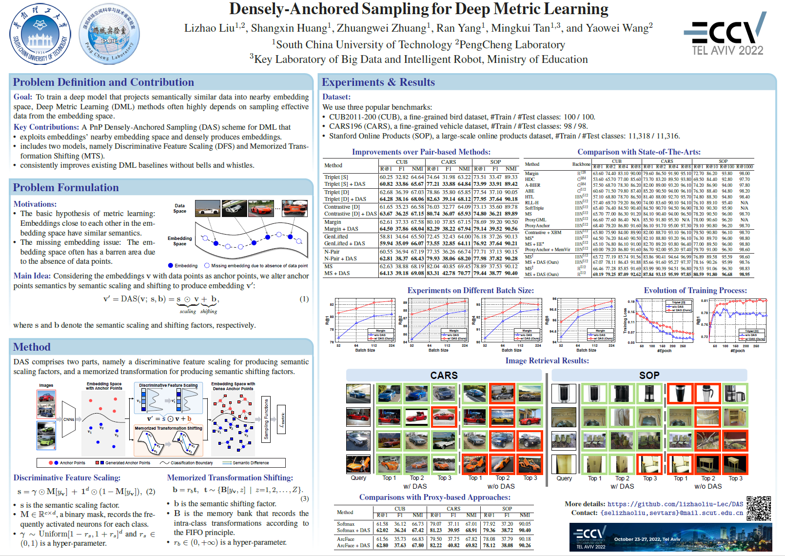

# LaTex Poster for DAS: Densely-Anchored Sampling for Deep Metric Learning (ECCV 2022)

## Poster Example

      

## Introduction
This code stores the LaTex source code for building the poster for DAS (ECCV 2020). This poster is based on the amazing [LaTex Poster Template](http://www.brian-amberg.de/uni/poster/). You may try to design your own poster based on this example. Please refer to (http://www.brian-amberg.de/uni/poster/) for more examples and FAQ.

- Open `poster_landscape.pdf` to see the built poster.

- Type `Make` to rebuild the poster.

## Contribution
The presentation materials are prepared by [Lizhao Liu](https://github.com/lizhaoliu-Lec) and [Shangxin Huang](https://github.com/vtars).

## Reference
- [Speech2Action: Cross-modal Supervision for Action Recognition (CVPR 2020)](https://github.com/a-nagrani/CVPR2020_Poster)
- [TOM-Net: Learning Transparent Object Matting from a Single Image (CVPR 2018)](https://github.com/guanyingc/TOM-Net_Poster_LaTex)
- [PS-FCN: A Flexible Learning Framework for Photometric Stereo (ECCV 2018)](https://github.com/guanyingc/PS-FCN_Poster_LaTex)
